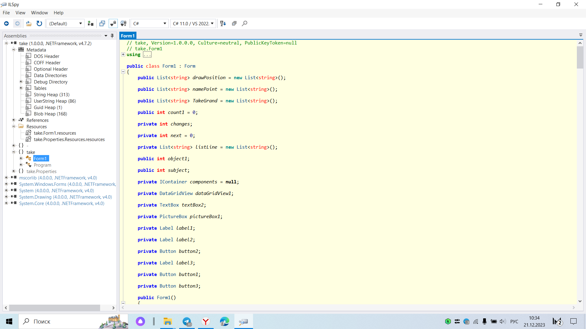

# Лабораторная работа № 4. Разработка безопасного программного обеспечения
Работу выполнил студент гр. БИ-41: Ахметзянов Эмиль .
# Статический анализ кода с использованием PVS-studio

# Защита от несанкционированного искажения: использование обфускации при компиляции. Проверять с использованием инструмента ILSpy (для C#) или дизассемблер (для С++).

